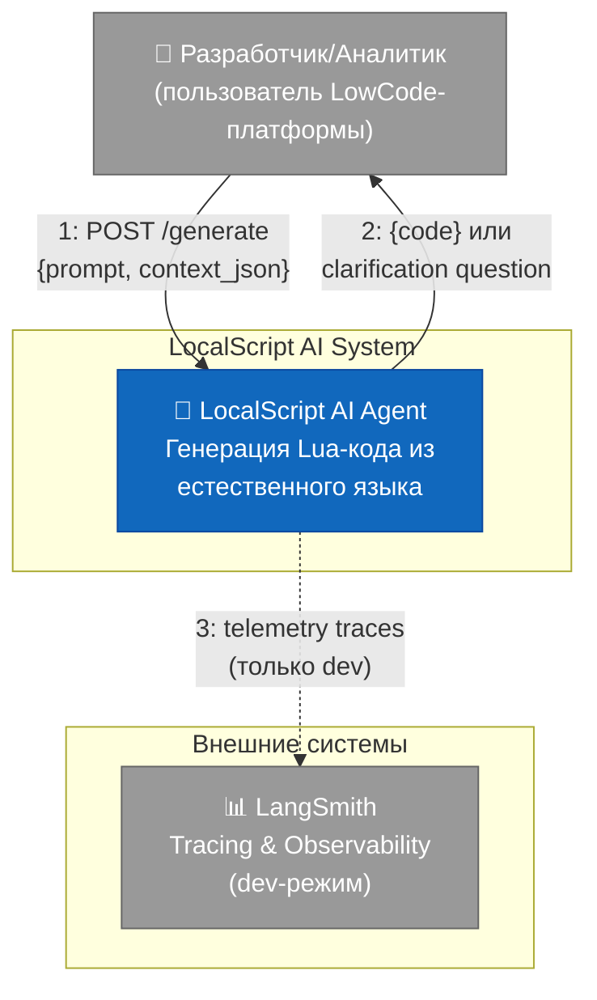
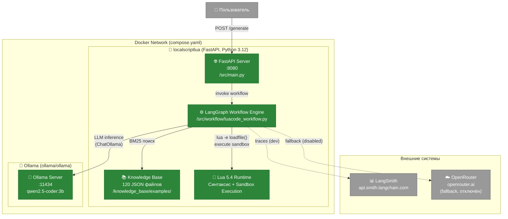
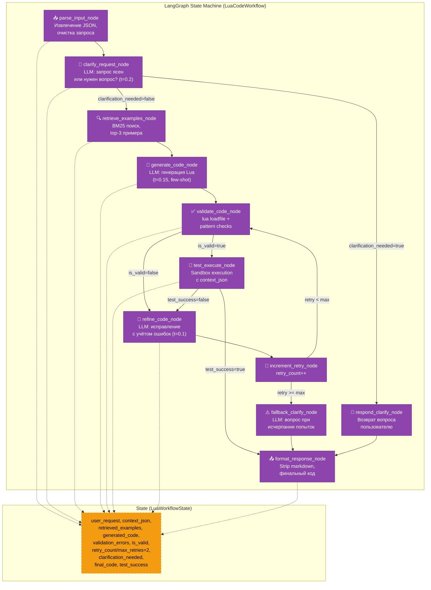
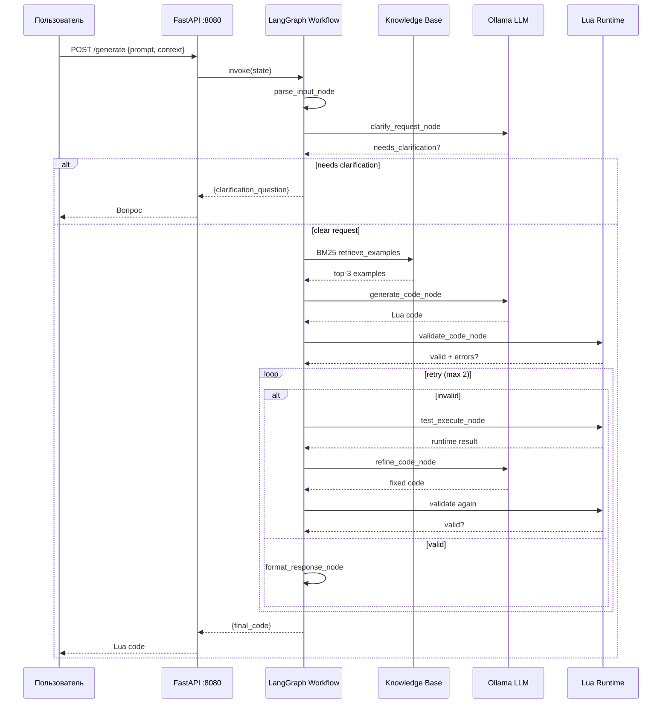

# C4 Architecture — LocalScript AI Agent

## Обзор системы

**LocalScript AI Agent** — хакатонный проект: локальный AI-агент, генерирующий Lua-код из запросов на естественном языке. Работает полностью оффлайн (Ollama, без внешних LLM-API), с бюджетом VRAM ≤ 8 ГБ.

**Ключевые требования:**
- Docker/docker-compose запуск одной командой
- Генерация корректного Lua-кода для LowCode-платформы (wf.vars, _utils.array)
- Самокоррекция через валидацию синтаксиса + песочницу
- Clarification-диалог при неясных запросах
- Few-shot retrieval из knowledge base (120 примеров)

---

## Level 1 — System Context Diagram



**Описание:**

| Элемент | Роль |
|---|---|
| **Разработчик** | Отправляет задачу на естественном языке (RU/EN) + контекст с переменными воркфлоу, получает готовый Lua-код |
| **LocalScript AI Agent** | AI-система: принимает запрос → извлекает примеры → генерирует код → валидирует → самокорректирует → возвращает результат |
| **LangSmith** | Внешний сервис трассировки (включён только в разработке, не используется в production/inference) |

---

## Level 2 — Container Diagram



**Описание контейнеров:**

| Контейнер | Технология | Роль |
|---|---|---|
| **FastAPI Server** | Python 3.12, FastAPI, Uvicorn | HTTP API: `/health`, `/generate`. Pydantic-валидация запросов |
| **LangGraph Workflow Engine** | LangChain + LangGraph | State machine с 11 узлами: парсинг → clarification → retrieval → генерация → валидация → тест → коррекция → форматирование |
| **Knowledge Base** | 120 JSON файлов + BM25 index | Few-shot примеры для retrieval-augmented generation (RAG без векторной БД) |
| **Lua 5.4 Runtime** | lua5.4 (apt) | Синтаксическая валидация (`loadfile`) + sandboxed execution с моками `_utils.array`, `bit32`, `string.trim` |
| **Ollama Server** | ollama/ollama (Go/CUDA) | Локальный LLM inference. Модель: `qwen2.5-coder:3b` (≤ 8 GB VRAM) |

---

## Level 3 — Component Diagram (LangGraph Workflow Engine)



**Маршруты выполнения:**

| Сценарий | Путь | LLM-вызовы |
|---|---|---|
| **Идеальный** (ясный запрос, валидный код) | parse → clarify(ok) → retrieve → generate → validate(ok) → format | 2 |
| **Самокоррекция** (ошибка валидации) | ... → generate → validate(err) → refine → retry → validate(ok) → format | 3 |
| **Максимальная коррекция** (2 retry) | ... → validate → refine → retry → validate → refine → retry → validate → fallback → format | 5 |
| **Clarification** (нужен вопрос) | parse → clarify(need_q) → respond_clarify → format | 1 |

---

## Level 4 — Code/Node Details (Детализация узлов)

### Node 1: `parse_input_node`
**Вход:** `{"prompt": "...", "context_json": {"wf": {"vars": {...}}}}`
**Логика:**
- Извлекает embedded JSON из prompt (если есть)
- Разделяет задачу и данные
- Очищает текст от markdown-артефактов
**Выход:** `user_request`, `context_json`

### Node 2: `clarify_request_node`
**LLM:** ChatOllama (temperature=0.2)
**Промпт:** "Запрос ясен для генерации Lua-кода или требует уточнения? Ответь JSON: `{{needs_clarification: bool, question: string}}`"
**Выход:** `clarification_needed: bool`, `clarification_question: string`

### Node 3: `retrieve_examples_node`
**Алгоритм:** BM25 over 120 JSON файлов
**Индекс:** Кэшированный inverted index с IDF
**Скоринг:** TF-IDF + бонусы за keyword match (+3) + stemming prefix (+1)
**Фильтр:** min_score ≥ 1.0
**Выход:** `retrieved_examples: list[top-3 formatted]`

### Node 4: `generate_code_node`
**LLM:** ChatOllama (temperature=0.15, num_predict=1024)
**Промпт:** System prompt с правилами Lua + context_json schema + few-shot примеры + user_request
**Выход:** `generated_code: string` (Lua code, возможно с markdown fences)

### Node 5: `validate_code_node`
**Проверки:**
1. Синтаксис: `lua -e "loadfile(tmp.lua)"` — реальная компиляция
2. Паттерны:
   - ✅ Есть `wf.vars` или `wf.initVariables`
   - ✅ Есть `return`
   - ❌ Нет JsonPath (`$.pattern`)
   - ❌ Нет опасных вызовов: `os.execute`, `io.popen`, `loadstring`, `io.open`, `require`, `dofile`, `debug`
   - ❌ Нет обходов песочницы: `_G[...]`, `setfenv`, `rawset(_G, ...)`
**Выход:** `is_valid: bool`, `validation_errors: list[str]`

### Node 6: `test_execute_node`
**Песочница:**
- Конвертация Python dict → Lua table (`_json_to_lua`)
- Mock `_utils.array`: new, markAsArray, concat, map, filter, sum, reduce, sort, reverse, find, length
- Polyfill `bit32` (13 функций)
- Polyfill `string.trim`
- Блокировка опасных globals
- Timeout: 10 сек
- Circular reference detection
**Выход:** `test_success: bool`, `test_output: any`, `test_error: str|None`

### Node 7: `refine_code_node`
**LLM:** ChatOllama (temperature=0.1)
**Промпт:** "Исправь код. Ошибки: {validation_errors + test_error + semantic_errors}. Код: {generated_code}. Примеры: {retrieved_examples}"
**Выход:** `generated_code: string` (исправленный)

### Node 8: `increment_retry_node`
**Логика:** `retry_count += 1`, сброс `is_valid = None`
**Выход:** Updated state

### Node 9/10: `respond_clarify_node` / `fallback_clarify_node`
**respond_clarify:** Возвращает `clarification_question` из Node 2
**fallback:** LLM генерирует уточняющий вопрос при исчерпании retry (last resort)

### Node 11: `format_response_node`
**Логика:**
- Strip markdown code fences (````lua ... ````)
- Strip `lua{...}lua` wrappers
- Trim whitespace
**Выход:** `final_code: string` (чистый Lua)

---

## Data Flow — Полный цикл запроса



---

## Technology Stack

| Слой | Технология | Версия |
|---|---|---|
| **API Framework** | FastAPI + Uvicorn | 0.135.3 / 0.44.0 |
| **LLM Orchestration** | LangChain + LangGraph | 1.2.15 / 1.1.6 |
| **LLM Adapter** | langchain-ollama | 1.1.0 |
| **LLM Model** | qwen2.5-coder | 3b (compose) / 7b (fallback) |
| **Inference Server** | Ollama | latest |
| **Retrieval** | Custom BM25 (no vector DB) | — |
| **Runtime** | Lua 5.4 + Python 3.12-slim | — |
| **Validation** | Pydantic + lua loadfile + regex | — |
| **Tracing (dev)** | LangSmith | 0.7.30 |
| **Deployment** | Docker + docker-compose | — |

---

## Security & Privacy

| Аспект | Реализация |
|---|---|
| **Локальность** | LLM работает на Ollama, без внешних API |
| **Песочница Lua** | Блокировка os.execute, io.popen, loadstring, require, debug, _G |
| **Timeout execution** | 10 секунд на выполнение |
| **Pattern checks** | Запрет JsonPath, sandbox bypass, опасные функции |
| **Tracing** | LangSmith только в dev (LANGCHAIN_TRACING_V2=true) |

---

## Deployment Architecture

```
┌─────────────────────────────────────────────────┐
│                  Docker Host                     │
│                                                  │
│  ┌─────────────────────────┐  ┌───────────────┐  │
│  │  localscriptlua         │  │    ollama      │  │
│  │  (python:3.12-slim)     │  │  (ollama/      │  │
│  │                         │  │   ollama)      │  │
│  │  FastAPI :8080          │  │               │  │
│  │  LangGraph              │◄─┤ Ollama :11434 │  │
│  │  Lua 5.4 runtime        │  │  qwen2.5-      │  │
│  │  Knowledge Base/        │  │  coder:3b      │  │
│  │    examples/*.json      │  │  ollama_data   │  │
│  └─────────────────────────┘  └───────▲───────┘  │
│                                       │          │
│  ┌─────────────────────────┐          │          │
│  │  ollama-init (one-shot) │──────────┘          │
│  │  (pulls model on start) │                     │
│  └─────────────────────────┘                     │
└─────────────────────────────────────────────────┘
         ▲
         │ docker-compose up
         │
    User runs: docker compose up -d
```

---

## Ключевые архитектурные решения

1. **BM25 вместо векторной БД** — полностью локальный, не требует GPU для индексации, детерминированный
2. **LangGraph state machine** — явная модель состояний, контролируемый flow, retry logic
3. **Multi-stage validation** — синтаксис → паттерны → execution → semantic checks
4. **Self-correction loop** — LLM исправляет код на основе всех типов ошибок
5. **Clarification mode** — агент может задать вопрос вместо генерации мусора
6. **qwen2.5-coder:3b** — баланс между качеством кода и VRAM (≤ 8 ГБ)
