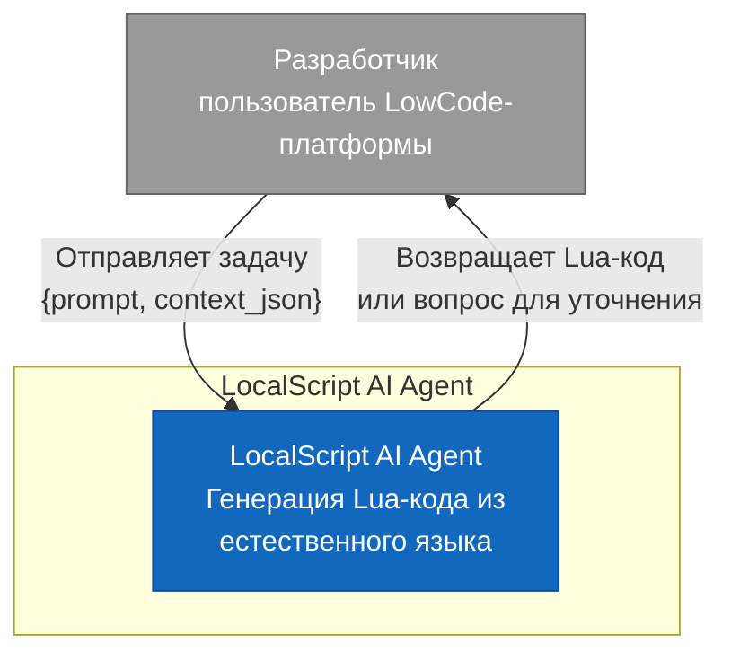
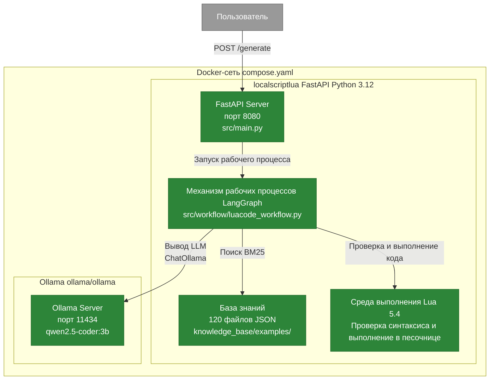
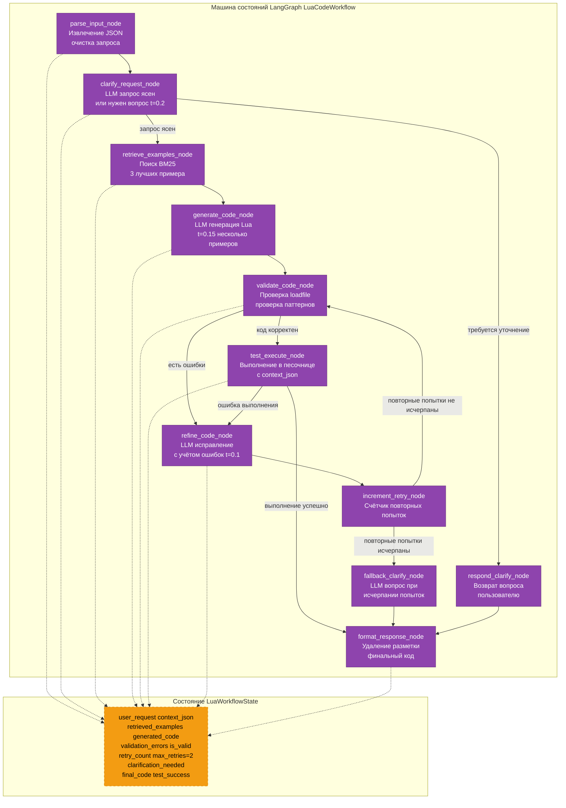
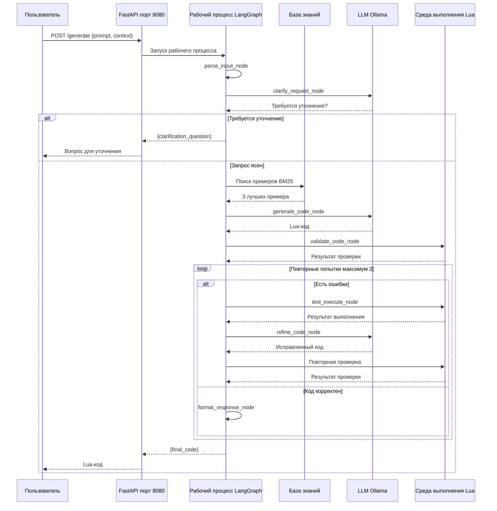

# C4-архитектура — LocalScript AI Agent

## Уровень 1 — Контекст системы

---

## Уровень 2 — Контейнеры

---

## Уровень 3 — Компоненты механизма LangGraph

---

## Уровень 4 — Последовательность выполнения запроса

